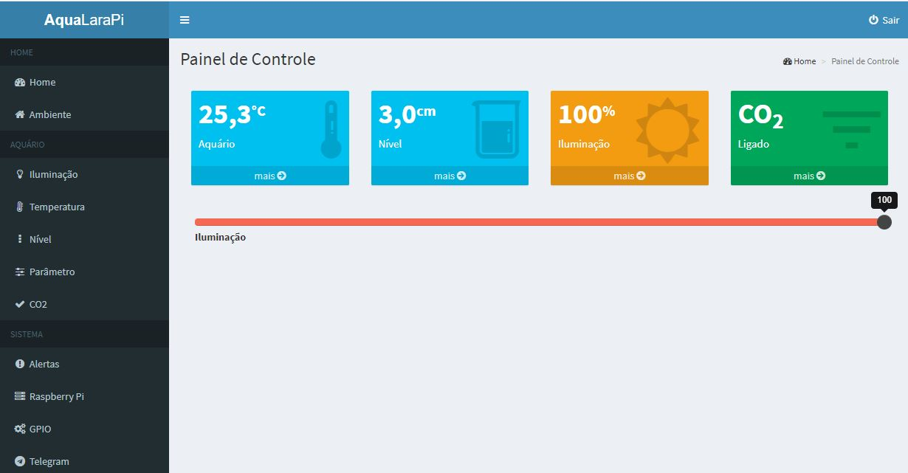

## Aqua Lara PI

### Features

- Web interface (Latavel - The PHP Framework for Web Artisans)
- Co2 timer
- Sunrise to sunset LED lighting automation
- Monitoring of water temperature.
- Monitoring of humidity and air temperature
- Telegram commands (photo, video, telemetry and lighting)
- Telegram alerts based telemetry for monitoring

